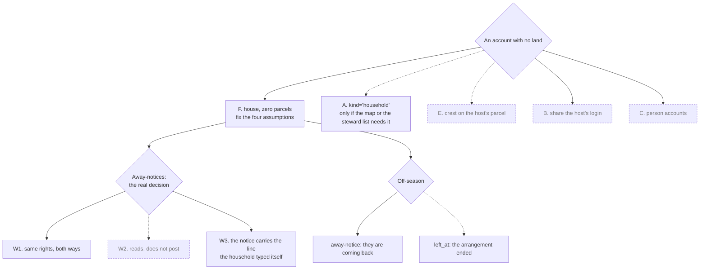

# An account for people who live here without land

Written 2026-09-06 as options. **Decided and built the same evening**, all
three answers from the owner:

1. **Option F** — a member without land is an ordinary house with an empty
   parcel list. No new kind of row.
2. **The Watchtower works for them exactly the same way** — W1, full symmetry,
   both directions.
3. **The steward ends such an account by deleting the house**, the button that
   already exists. `left_at` was designed below and **not built**; what that
   costs is written into § Ending a stay, and the button now says it out loud.

What shipped: `014_house_about.sql` (one line a house writes about itself),
the parcel count gone from both blocks of the Houses room, that line shown
beside a house's away-notices, and a delete confirm that names what it takes.
The sections below stay as the argument that got there.

## Answer first

- **The room's name is not the problem.** Four places in the code assume every
  account owns a parcel, or sorts by the kind of row it is. Fix those and
  "Houses" reads fine — a household without land is still a house in the village
  metaphor. It is the door, not the field.
- **The cheapest option is no new option at all**: a normal house row with zero
  parcels, named "Hiša Vrba", one login, many phones. No new kind, and no place
  in the code where the app can quietly rank one sort of member below another.
- **The real decision is the Watchtower, not the schema.** A part-time resident
  who posts an away-notice announces that a structure on somebody else's land is
  empty. The same account reads every other house's absence, and keeps reading
  it through the off-season. That is a social call the village makes, and the app
  should not pretend it is a checkbox.
- **Going home for the winter is not leaving.** They are two different states and
  the app must not answer them with one control: an off-season absence is an
  away-notice, exactly like a house that winters elsewhere; `left_at` is for an
  arrangement that has ended.
- **Recommended: option F, plus the four fixes, plus `left_at`.** Cost is not
  estimated here — `left_at` is needed under every option that gives an account
  at all, so it is not what separates them.

## Who this is about

| Shape | Where they sleep | What they need | What they do not have |
| --- | --- | --- | --- |
| Renting a hut from a house | On that house's parcel | Every room of the portal, the same as any house | A parcel of their own |
| Living in a vacant house from time to time | In a structure that belongs to another house | The same, and through an off-season they are not here for | A parcel, and a fixed season |

Both are groups, not individuals — the owner's own framing: a collective name,
one account, several phones. That is exactly what a house is today, minus the
land. **Neither is a guest**, and neither is a tenant in the app's language: the
portal has no landlord, and it should not grow one.

The **term of the arrangement** — how long, and what ends it — is not the app's
to hold. It belongs where the collective's other verbal agreements are written
down, in the homestead repo's agreements file, marked unwritten if it is. If it
has a term, that term is also the natural review date, and it is better than
"after a long silence" for every question below.

## What breaks today

Four places assume land, or sort by kind. None of them is about naming.

| Place | What it does now | What a landless account gets | Fix |
| --- | --- | --- | --- |
| `frontend/src/map/VillageMap.tsx:109` | `houses.filter(h => h.parcels?.length)` draws crests | Never appears on the home screen, which is the village's front door | A strip under the map with **every** house's crest, landed or not (see below) |
| `frontend/src/rooms/Houses.tsx:69` and `:118` | Every row prints `N parcels` — the houses block and the commons block both | Reads "0 parcels" beside a name | Drop the number in both. A parcel list is a list; a count next to a name is a tally |
| `backend/internal/httpapi/server.go:459` and `:511` | Coerces any unknown `kind` to `house`; the edit path whitelists two values | — | **Option A only**: a third kind must be named in both places, or a typo mints a full house |
| `backend/internal/httpapi/server.go:423` | `SELECT … FROM houses ORDER BY kind, name` | — | **Option A only**, and it is the sharp one: `'common' < 'house' < 'household'`, so a new kind puts households **last** in the Houses room, in "hand a task to", and in every notification target list — with nobody deciding it. Under F the sort key never changes |

The first one is the second class, and it is visual, not verbal. Renaming the
room does not touch it. The last one is the second class arriving by accident,
and it is the strongest single argument for F.

**The strip.** The first fix could be written as "a row under the map for the
houses without land". Do not: that encodes the same distinction one element
lower, in the same visual grammar. Make the strip carry **every** house — *Hiše v
vasi* — crest and name, alphabetical. Same code, same pixels, and the strip then
says nothing at all about who owns what.

## The options

| Option | Mechanism | What it buys | What it costs socially | Verdict |
| --- | --- | --- | --- | --- |
| **F. A house with no parcels** | Nothing new. A steward creates the house and assigns no land | Same rights by construction — there is no second row type to treat differently, and nothing in the schema records that this member has no land | The steward list cannot tell a household from a house that has not been given its land yet | **Recommend** |
| **A. `houses.kind = 'household'`** | A third kind, named explicitly in the create and the edit whitelist, plus a deliberate `ORDER BY` | The map strip and the steward list can be honest about who has land | Writes "this account has no land" into the schema, and hands every list a default order that ranks | Only if F proves not enough |
| **B. Share the host house's login** | Nothing at all | Nothing | The lodger posts as the landlord and reads the landlord's away-notices. Identity collapse | **No** |
| **C. Person accounts beside houses** | A second identity layer | Precision nobody asked for | Every room re-keyed: posts, sign-ups, tasks, tool loans, camp rows. Breaks the one invariant the whole app rests on | **No** |
| **D. Rename the room** | Copy only | — | "Homes"/"Domovi" is not wrong, but it renames the symptom | Keep **Houses**; change the subtitle |
| **E. The household's crest on the host's parcel** | Map join through a host pointer | The household appears on the map | **Writes tenancy onto the cadastre.** The map is a land view, and who sleeps where is not a boundary | **No** — the strip costs less and leaks less |

`left_at` is common to F and A both, so it is not part of what separates them.
The honest differential is: **A costs one UI branch, two whitelist edits and a
sort decision more than F.** F wins on the class argument, not on the count.

Dashed = not recommended, or not decided.

## The Watchtower is the real decision

Away-notices are burglary information. The portal keeps them inside the
logged-in app for that reason, and the push about one names no house and no
dates. A part-time account changes the shape of that risk in two directions.

**Outbound.** A household posts "away 10–14 September". The structure standing
empty is on someone else's parcel, and that someone may not know the notice
exists, or that the hut is empty at all.

**Inbound.** The same account reads every house's absence, for as long as it
holds a login — **and under W1 that includes the whole off-season, while they
are not even here.** There is no reduced view that fixes this and stays honest.
The levers are admission and revocation, which is the same argument as below,
applied to time instead of to rights.

| | What it means | Cost |
| --- | --- | --- |
| **W1. Full symmetry** | A household reads and posts away-notices exactly like a house | The decision moves where it belongs: the village decides who to let in, the app does not second-guess it. The village accepts a standing reader |
| **W2. Reads, does not post** | Its absence is the host's to post | Denies the thing it most needs — nobody watching its hut. A reduced right, wearing the word "same" |
| **W3. The notice names where they live** | The household's own line ("we are at the hut by the stream") rides along with its notices | One line. Not a system badge — text the household typed itself |

**Recommendation: W1 with the W3 line.** Same rights, and the host is not
surprised by a notice about a building on their land. If the village is not
comfortable with W1, the honest answer is not to give the account, rather than
to give a hollowed-out one.

### The other threat model, and it argues for F

Away-notices are about burglary. There is a second exposure, smaller and worth
one row: **the database becomes a written record that a structure on somebody
else's parcel is lived in by a non-owner.**

| Question | Answer |
| --- | --- |
| Who can see it | A steward's phone, the nightly `VACUUM INTO` backup, `GET /api/export`. Not the public repo, not the map |
| What it could be worth to someone | Evidence of occupancy, in a tenure argument or inside the permit envelope the collective shares |
| Likely | Nobody ever looks, and it costs nothing |
| What each option writes down | **E** writes the tenancy onto the cadastre. **A** writes "this account has no land" into the schema. **F** writes nothing — the only trace is the line the household types about itself, which is theirs to write or to leave empty |

## Off-season, and ending a stay

Two different states, and the app must not answer them with one control. A
household that goes home for the winter produces exactly the silence that looks
like leaving.

| State | What it is | What the app does — **decided** |
| --- | --- | --- |
| **Away for the season** | Not here, coming back | An away-notice in the Watchtower, the same one any house uses when it winters elsewhere. Login, crest and rooms all stay. Nothing expires, nothing is revoked |
| **The arrangement ended** | Not coming back | **A steward deletes the house** (owner's decision 2026-09-06) — the 🗑 that already exists in the Houses room |

**Deleting is not free, and the button now says so.** Every table that hangs off
a house cascades: its devices and push subscriptions, its posts and comments —
including its replies inside other houses' threads — its events, its sign-ups,
its needs, give-aways, away-notices, the tools it owns, its wishes, its projects
and their tasks, and its campground rows. The confirm dialog lists them. Nobody
should press it expecting the row to go quiet.

**It is not, however, irreversible, and the dialog must not claim it is.** The
nightly `VACUUM INTO` backup holds the house — restoring it rolls the whole
village back to last night, which is a real cost but not a permanent loss. So
the dialog says: export first if any of it matters. On the homestead repo's
reversibility rubric this is amber, not red.

**A deletion the leaving household did not consent to.** The cascade reaches
comments that house wrote inside *other* houses' threads. Those threads lose
lines their own participants wrote around. That is an argument for exporting
first, not for keeping the account.

**One coupling to keep in view.** Deletion is the only exit and only a steward
can press it. There is one steward today, and he is away part of the week, so a
stay that ends badly waits for him. The second steward (`NOW.md`) is what closes
that, not a change here.

**The softer variant, designed and not built.** `houses.left_at` plus who set
it, the shape `notify_off_global` already uses: devices and invite revoked, the
row still returned by `GET /api/houses` **with the flag** so every consumer
filters and no old give-away loses its claimer's name (`Market.tsx:15` resolves
names from that list), the house faded to the bottom of the room, and coming
back is a steward clearing the flag. It is one column and a handful of filters.
It exists here so the choice can be changed without re-deriving it.

Either way, **revocation is not retroactive**: whatever that account has already
read, it has read.

## What must not be built

- No count, rank, or sort that puts households after houses — including the one
  `ORDER BY kind, name` would give away for free.
- No system-written "guest" badge. Where somebody lives is a line they write.
- No host approval step in code. Putting the landlord in the app as a gatekeeper
  turns an agreement between neighbours into a permission screen.
- **A pairing code cannot do this job.** It adds one more phone to a house that
  is already inside (`pairings.house_id`), so handing one to a lodger makes them
  a phone of the host's house — that is option B under another name.
- No steward by default, and no rule that a household may never be one. It is
  the village's call, made in the room, not a class in the schema.
- Nothing on the cadastre map about who sleeps where.

## What the villager sees

Drawings in `docs/diagrams/`: `membership-houses-room.svg` (the Houses room
today, under F, and under A) and `membership-map-strip.svg` (the home screen).
They restate the tables above and add no claim of their own. Names and parcel
numbers in them are invented.

**What F actually cost, once built:**

- Houses room: subtitle is now "houses, with land and without". The `N parcels`
  count is gone from both blocks — a parcel list is a list. A row shows the line
  its house wrote about itself.
- `houses.about`, 120 characters, written by the house, blankable. Any house may
  write one, so it is not a badge. It is also what the Watchtower shows beside
  that house's absence — the W3 line, without a second field.
- Home screen: **nothing**. The legend under the map already lists every house,
  landed or not, so the strip this doc proposed was never needed — with one
  qualifier: the legend renders only in map mode, and the home widget opens on
  **weather** by default, so a villager who never taps 🗺️ never sees it. That is
  accepted: the map view is where "who lives here" belongs.
  `docs/diagrams/membership-map-strip.svg` draws the strip that was proposed and
  not built.
- Everywhere else: nothing at all. A household is a house.

Under **A** the same screens gain one visible difference: the strip and the
steward's list can be generated from `kind`. That is the whole gain, and the
`ORDER BY` row above is what it costs.

## Decision table

| Decision | Outcome | Who to ask | By when |
| --- | --- | --- | --- |
| F or A | ✅ **F**, decided 2026-09-06. Built | — | Done |
| Away-notices | ✅ **W1**, full symmetry, decided 2026-09-06. The W3 line rides on `about` | — | Done |
| The off-season | ✅ An away-notice, not an ended account | — | Done |
| Ending a stay | ✅ **The steward deletes the house.** `left_at` designed, not built | — | Done |
| The room's name | ✅ Keep **Houses / Hiše**, subtitle changed | A Slovenian-speaking house checks "hiše, z zemljo in brez" | With the first household |
| Naming convention for a household | `TBD` — "Hiša <something>" was the owner's own suggestion | The households themselves | When the first one joins |
| Steward eligibility | Not by default. No rule against it | The village | Not urgent |
| The term of the arrangement | Written down with the collective's other agreements, not in the app | The two parties, and the village | Before the account exists |

> QUESTION FOR DENIS: what does the village call such a household? "Hiša
> <something>" was your own suggestion and it is the only thing here still
> `TBD` — the households pick their own name when the first one joins.
