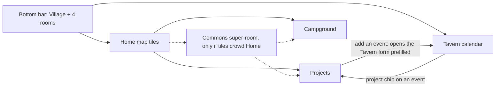

# Two more rooms: Projects and Campground

Design only. Nothing here is implemented. 2026-09-05.

## Answer first

- Put **Projects** and **Campground** on the Home map as tiles with `nav: false`, the way Houses lives today. The bottom bar stays five.
- The **Tavern calendar is the daily door to Projects**: a project event shows a project chip, and the chip opens the project. The tile is the second door.
- Campground is a rare action (a few times a month, `TBD`), so two taps from anywhere is enough.
- Projects gets one new push kind, `projects`. Campground gets none. Quiet hours apply to both.
- Campground records amounts. It stays a list because the only sum is the collective's, never a house's. That guard is a rule, not a schema.

## Navigation options

The bar gives each item about 60 px. Home already renders every `ROOMS` entry, `nav: false` included (`App.tsx` `Home`).

| Option | What the villager sees | Taps to a room | What breaks | Verdict |
| --- | --- | --- | --- | --- |
| A. Off the bar, tiles on Home (like Houses) | Bar unchanged. Two more buildings on the map, with badges. | 2 from anywhere (Village, tile). 1 from a calendar chip. | Nothing in code. Tiles grow to 7, so Home scrolls one more row on a phone. | **Recommend.** The pattern exists and CLAUDE.md sanctions it. |
| B. Nest: Projects under Tavern, Campground under Watchtower | Tavern gets a fourth stacked part. Watchtower gets a "visitors" part. | 1 + scroll | Tavern is already three parts. Money in the burglary-info room mixes two purposes. | No. Watchtower stays about empty houses only. |
| C. A "More" building in the bar | A sixth bar item that opens a list. | 2 | Six items at ~50 px each, labels truncate. Breaks the "fits five" invariant. A generic door in a village metaphor. | No. |
| D. Two tile rows on Home, bar shows the 4 most used | Bar differs per house and over time. | 1 or 2 | Muscle memory dies. "Most used" needs a usage counter per house, which the repo does not want to hold. | No. |
| E. Contextual bar (bar changes per room) | In Tavern the bar shows Projects, elsewhere not. | 1 inside the context, unreachable outside | The bar stops being a map of the app. Hard to explain to a house that opens it twice a week. | No. |
| F. "Commons" super-room: Projects + Campground + future Archive | One tile that opens a second menu. | 3 (Village, Commons, room) | One tap more than A for no gain today. It earns a place only when tiles pass ~8. | Later, if tiles crowd Home. Dashed in the diagram. |
| G. Long-press on a tile or bar item | Hidden menu. | 1 gesture | Undiscoverable. iOS long-press fights text selection and the context menu. | No. |

## Projects

A project is a long job. Tasks are its parts, each with a due date and one house that holds it. Events are its dates and live in the existing `events` table.

### Data model (migration `007_projects.sql`, append-only)

| Table | Fields | Notes |
| --- | --- | --- |
| `projects` | `id`, `house_id` (creator), `title`, `notes`, `due_at` (nullable), `state` open/done, `done_at`, `created_at` | A house edits its own rows, a steward any row (`canEdit`). |
| `project_tasks` | `id`, `project_id` (cascade), `house_id` (creator), `title`, `notes`, `assigned_to` → `houses` (SET NULL), `due_at`, `state` open/done, `done_at`, `closing_note`, `created_at` | One house per task. Several houses on one task: make an event and use sign-ups. |
| `events` + `project_id` → `projects` (SET NULL) | `ALTER TABLE events ADD COLUMN project_id` | Same shape as `needs.run_id`. |
| `events` + `task_id` → `project_tasks` (SET NULL) | `ALTER TABLE events ADD COLUMN task_id` | The backend fills `project_id` from the task. `task_id` without a project is rejected. |

Deleting a project deletes its tasks. Its events stay in the calendar with the link cleared. Nothing else deletes anything: a done task and a past event stay as notes.
`GET /api/export` must include the two new tables in the same change, or the exit stops being complete.

### Permissions

| Action | Who | Why |
| --- | --- | --- |
| Create a project, add a task, add an event | Any house | Same as events today. |
| Assign a task to a house | The house itself ("I take it"), the project creator, a steward | Self-take mirrors Market `taken_by`. Assigning a neighbour without asking is a social risk, see the question below. |
| Close a task | The assigned house, the creator, a steward | The house that did the work says so. |
| Mark a project done, or reopen it | The creator, a steward | Open tasks are not blocked. They stay listed under the done project as "left open". |
| Delete | `canEdit`, with the confirm dialog every room uses | |

> QUESTION FOR DENIS: may a house assign a task to another house in the app, or only offer it? Recommendation: **offer only in v0** — a task without `assigned_to` shows "I take it". The creator assigns only in v1, after the houses say they want it.

### UX sketch

**Projects list (`#/projects`)**
- Header, then "+ New project" opening an inline form: title, due date, notes.
- Open projects as cards: crest, title, due date, "3 of 5 tasks done", next event date.
- Below, a collapsed section "Finished" with done projects, same cards, faded like a done need.
- Home badge: "N tasks due this week", built like the shed badge.
- No per-house count anywhere. "3 of 5" is a project's progress, not a house's.

**Project page (`#/projects/:id`)**
- Header: title, due date, state, creator crest. "Done" button for `canEdit`.
- Tasks: open first, each a card with due date, holder name or "I take it", "Done" button. Done tasks below, faded, showing `closing_note`.
- "+ Add a task" inline form: title, due date, notes.
- Events: "Ahead" then "Happened", cards reused from `Calendar.tsx` with sign-ups.
- "+ Add an event" is a link to `#/tavern?project=ID` — one event form in the app, not two.
- Closing a task asks for one optional line, stored as `closing_note`.

**Tavern calendar**
- The event form gets a "Project" select, like the run select in Market. Picking a project shows a "Task" select of that project's open tasks.
- `?project=ID` opens the form with the project preselected.
- The event card shows a chip "📋 project title" that links to the project page.
- The month grid does not change.

### Push

| Moment | Kind | Who hears | Quiet hours |
| --- | --- | --- | --- |
| New project | `projects` | All houses but the author | Waits |
| Task assigned to a house | `projects` | That house only (`notifyHouse`) | Waits |
| New event on a project | `events` (existing) | All houses but the author | Waits |
| Due reminder | — | — | Not in v0. If added, read off `due_at` and one `reminded_at`, like tools. No counter. |

`Kinds` grows to eight. The `notify_off` comment, the "all seven kinds" line in CLAUDE.md, the Houses prefs screen and `banner_test.go` change in the same commit.
Lock-screen line: a task push names a house and a date. It says nothing about an empty house, so it sits on the "named" side of the rule. Free-text titles can leak anything, same as events today.

### "Completed stays visible"

Done is a state, not a deletion. The list shows open projects on top and done ones in a collapsed "Finished" section. A done project page reads the same as an open one, with tasks and events as notes. Reopen is one button for `canEdit`. The system never archives or purges on its own.

### v0 cuts

1. No due reminders. Push only on create and on assign.
2. One `assigned_to` per task. No multi-house tasks, no assignment by others (offer only).
3. No second event form. The project page links to the Tavern form prefilled.

## Campground

The village has a parking spot listed on park4night. A house collects money from a camper. The room records one collection per row.

### Data model (migration `008_camp.sql`)

| Table | Fields | Notes |
| --- | --- | --- |
| `camp_takings` | `id`, `house_id` (who collected), `collected_by` (optional first name, like `posts.author`), `from_who` free text, `amount_cents`, `taken_on` date, `notes`, `state` held/handed, `handed_at`, `created_at` | Currency is EUR, implied. One row is one fact. |

No plate column, no phone, no photo, no nights count. `from_who` is a label a villager would say aloud: "grey camper", "family from NL".

### UX in one card (`#/camp`)

- Form on top: date (today), from who, amount in €, collected by (first name, optional), notes. "Save".
- Rows newest first: date · from · amount · crest + house name · chip "held" or "handed over".
- Button "Handed over" on held rows, for `canEdit`. Sets `handed_at`.
- Footer: "This month: €X · This season: €Y" — the collective's sum only.
- No push kind, no Home badge in v0. Money should not buzz phones.
- Delete: `canEdit`, confirm dialog.

### Privacy

- A registration plate likely counts as personal data under GDPR, because the register links it to a person. *Requires professional verification*, 2026-09-05, unsourced. So the field is free text and the label steers away from plates. The app cannot stop a villager typing one.
- Retention: `TBD`. Recommendation: a steward clears `from_who` on rows older than 12 months, by a button, not a nightly job, until the privacy note says otherwise.
- The one-page privacy note in the plan needs a line about campers. The collective as data controller is `TBD` (legal form, `SITE.md` § Tenure).
- Income of the collective from a listed parking spot may have tax or registration consequences. The app records; it does not decide. *Requires professional verification*, 2026-09-05. Ask the board before the room ships.

### Who sees totals

| Choice | For | Against |
| --- | --- | --- |
| All houses see rows and the collective's monthly and season sums | The land is common, the money is common. Hidden sums breed suspicion. | A house may prefer not to show what it holds. |
| Stewards only see sums | Fewer eyes on cash. | A steward-only number is the first step to a private ledger. |

Recommendation: **all houses**, rows and sums. Nobody, steward included, gets a per-house sum in the UI.

### How it stays a list, not a ledger

The plan's rule protects neighbour-to-neighbour reciprocity: counted favours turn into debt. Camp money is stranger-to-collective cash, held in trust by one house until handed over. Recording it answers "where is the collective's money", which a legal entity owes its members. So amounts are stored. The line the schema cannot hold and the rule must: **no sum per house, no "who collected most", no balance a house owes**. "Held" rows show as names on a list, never as a figure. With `amount_cents` in the table a per-house sum is one query away. That is honest to say, and it goes into CLAUDE.md as an invariant next to the tool-shed one.

> QUESTION FOR DENIS: who is the treasurer, and is there a cash box or a bank account? "Handed over" needs a "to whom", or it is a state with no meaning. `TBD` until the collective answers.

## What changes elsewhere when this is built

`village.md` gets one line per room. CLAUDE.md gets the eighth kind, the campground invariant and the `nav: false` note. `i18n.tsx` gets Slovenian labels: `TBD`, ask a Slovenian-speaking house ("Projekti" and "Kamp" are guesses). `README.md` gets the new routes. The export gets three tables. Old notification links do not change.

## Decisions

| Decision | Recommendation | By when | Who to ask |
| --- | --- | --- | --- |
| Navigation for two more rooms | Option A, tiles off the bar, calendar chip as the daily door | Before the first line of code | Yourself. Two houses after 4 weeks: is two taps too many? |
| Assign or offer tasks | Offer only in v0 | Before `007_projects.sql` | The two or three houses that will use Projects |
| Store camp amounts | Yes, with the no-per-house-sum invariant in CLAUDE.md | Before `008_camp.sql` | The collective's board |
| Who sees camp sums | All houses | Before the room ships | The board, in one meeting |
| Camp income, tax and registration | Ask before shipping. App records only. | Before the room ships | An accountant or the collective's lawyer |
| `from_who` retention | Steward button, 12 months | With the privacy note | The board, a lawyer confirms |
| Treasurer and hand-over target | `TBD` | Before the "Handed over" button means anything | The collective |
| Slovenian room names | `TBD` | Before shipping | A Slovenian-speaking house |
